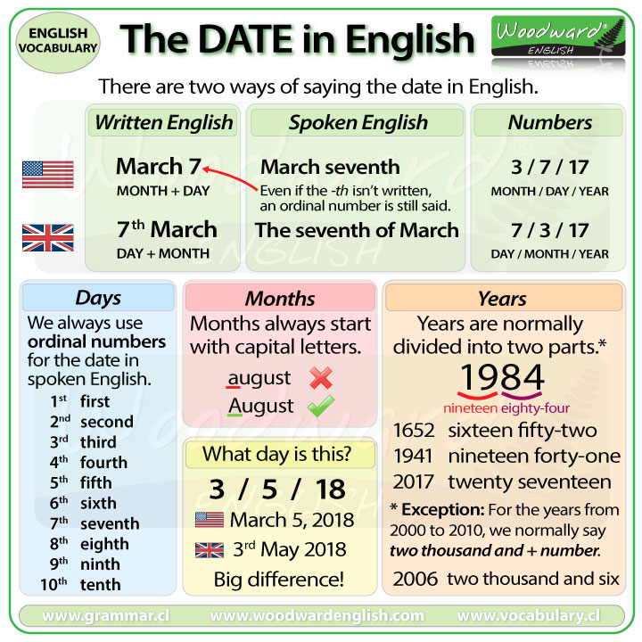

# English

## Grammar

### Date

| American English          | British English                                         |
| ------------------------- | ------------------------------------------------------- |
| Sept 6                    | 6 Sept                                                  |
| September 6               | 6 September                                             |
| September 6, 2019         | 6 September 2019 / the 6th of September, 2019           |
| Monday, September 6, 2019 | Monday, 6 Sept 2019 / Monday the 6th of September, 2019 |

  
Summary Chart

Ref: [How to say the DATE in English Woodward English](https://www.woodwardenglish.com/lesson/how-to-say-the-date-in-english/)

See also:

- [Correct Date Format | How To Write The Date In English | IELTS Australia](https://ielts.com.au/australia/prepare/article-how-to-write-the-date-correctly)
- [How to Write Dates Correctly | Grammarly](https://www.grammarly.com/blog/how-to-write-dates/)

## Style

### Avoid passive voice

> if you don’t want your readers to know who is performing an action, or if the action itself is more important than who performed the action, you might choose to use a passive voice.

> In short, when used thoughtfully, a passive voice can be a useful tool, but in most cases, switching to an active voice will make your writing clearer, livelier and far more enjoyable to read.

- [What is Passive Voice and Why Should You Avoid It? | Open Colleges](https://www.opencolleges.edu.au/careers/blog/what-passive-voice-and-why-should-you-avoid-it)

### E-Prime

> E-Prime (short for English-Prime or English Prime, sometimes denoted É or E′) refers to a version of the English language that excludes all forms of the verb to be, including all conjugations, contractions and archaic forms.

- [E-Prime - Wikipedia](https://en.wikipedia.org/wiki/E-Prime)
- [E-Prime: English without the verb 'to be' | Hacker News](https://news.ycombinator.com/item?id=10688201)
